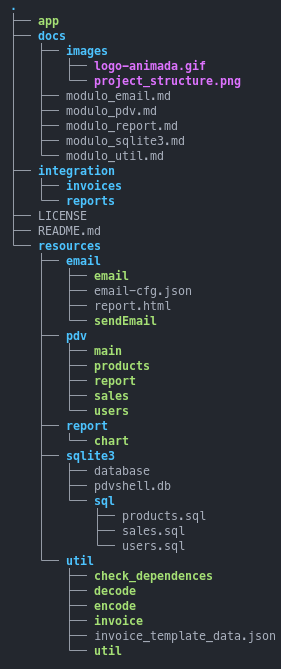

- [Introdução](#introdução)
- [Requisitos](#requisitos)
- [Binarios em Go lang (incluidos no repositório)](#binarios-em-go-lang-incluidos-no-repositório)
  - [Estrutura do Projeto](#estrutura-do-projeto)
    - [Diretório Integration](#diretório-integration)
    - [Diretório Resources](#diretório-resources)
- [Roadmap](#roadmap)
  - [Pontos de melhorias](#pontos-de-melhorias)
- [Como iniciar?](#como-iniciar)
    - [Usuario Administrador](#usuario-administrador)
    - [Usuario Vendedor](#usuario-vendedor)
- [FAQ](#faq)
  - [Como configurar o Envio de Email?](#como-configurar-o-envio-de-email)
  - [Como eu faço para mudar o nome do Mercadinho?](#como-eu-faço-para-mudar-o-nome-do-mercadinho)


# Introdução 

Olá essa é uma tentativa de simular uma simples implementação de sistema de PDV inspirado no repositório do [slackjeff - pdvShell](https://github.com/slackjeff/pdvShell/) 

Devido em alguns momentos a complexidade de ser implementado algumas funcionalidades como por exemplo geração do invoice em pdf foi necessário o uso de CLI em go lang para apoio.

Projeto foi feito exclusivamente para testar meus conhecimentos em Shell Script, como deixarei no Github casao mais pessoas possam se interessar e ajudar em melhorias fiquem a vontade!

Lembrando que poderá ter alguns problemas ainda mais que é a primeira versão, mas qual software é 100% funcional e nunca dá problema?


<p> </a>
</p>

:heavy_exclamation_mark: **Linguagens utilziadas**:heavy_exclamation_mark:

<p>
    <a href="https://github.com/waltenne/pdv-shell" target="_blank"></a>
    <a href="https://github.com/waltenne/pdv-shell" target="_blank"></a>
</p>


<a href="https://github.com/waltenne/pdv-shell/releases"></a>

# Requisitos

Será necessário a instalação dos sequites pacotes no Sistem Operacional.

- [x] :white_square_button: [sqlite3](https://www.geeksforgeeks.org/how-to-install-sqlite-3-in-ubuntu/)
- [x] :white_square_button: [jq](https://jqlang.github.io/jq/)
- [x] :white_square_button: [gum](https://github.com/charmbracelet/gum#installation)

# Binarios em Go lang (incluidos no repositório)

- [x] :white_check_mark: [invoice](https://github.com/maaslalani/invoice)
- [x] :white_check_mark: [sendmail](https://src.fedoraproject.org/repo/pkgs/sendmail/sendmail.8.15.2.tar.gz/a824fa7dea4d3341efb6462ccd816f00/)


## Estrutura do Projeto

O projetoi foi estruturado algo "parecido" que temos hoje em linguagens mais avançadas que lembra vagamente de Orientação a Objetos.

### Diretório Integration

Responsável por guardar os arquivos dos relatórios e invoices.

### Diretório Resources

Responsável por guardar os arquivos e ou binários que serão importados pelo script principal app, deixo uma documentação básica de cada módulo.

- [Móduio Email](./docs/modulo_email.md)
- [Móduio PDV](./docs/modulo_pdv.md)
- [Móduio Report](./docs/modulo_report.md)
- [Móduio sqlite3](./docs/modulo_sqlite3.md)
- [Móduio Util](./docs/modulo_email.md)



# Roadmap

- [x] Banco de Dados
  - [x] Tabela Produtos
  - [x] Tabela Vendas
  - [x] Tabela Usuários
- [x] Sistema Usuários
  - [X] Criação Usuários c/ senha criptografada
- [x] Utils
  - [X] Encriptar/Decriptar Senha Usuários
- [x] Sistema Login
  - [X] Validação do usuário/senha
  - [x] Validação de permissão admin
- [x] Sistema Produtos
  - [x] Cadastro de Produtos
  - [x] Remover Produtos
  - [x] Consultar Estoque
- [ ] Sistema Vendas
  - [?] Validar Existencia de Produtos
  - [x] Realizar Venda
  - [X] Gerar Invoice
  - [X] Gerar Order JSON
  - [x] Remover Estoque após a venda
  - [x] Cadastrar a Venda na tabela Sales
  - [ ] Envio por email ao finalizar venda ( a ser testado )
- [ ] Sistema Relatório
  - [X] Relatório de Venda Diário
  - [X] Relatório de Venda da Semana Atual
  - [ ] Envio por email após geração do relatório ( a ser implementado )


## Pontos de melhorias 

- Aprimorar o Sistema de Relatório
- Aprimorar a geração do Invoice, no estado atual, ao gerar invoice com produtos onde o nome tem espaço por exemplo "Leite XPTO 5L", o nome do produto fica com aspas duplas no PDF


# Como iniciar?

Para o funcionamento básico deixo dois usuários cadastrados, o que diferencia ambos é as opções que irão aparecer no menu.

basta executar o processo **app**

### Usuario Administrador

```
Usuario admin
Senha admin
```

### Usuario Vendedor

```
Usuario vendedor01
Senha 12345
```


# FAQ

## Como configurar o Envio de Email?

Basta editar o arquivo [email-cfg.json](./resources/email/email-cfg.json), colocando as configurações da conta de e-mail que irá realizar o envio.

## Como eu faço para mudar o nome do Mercadinho?

Basta editar o arquivo [util](./resources/util/util), mudando o conteúdo da variável **store_name**

